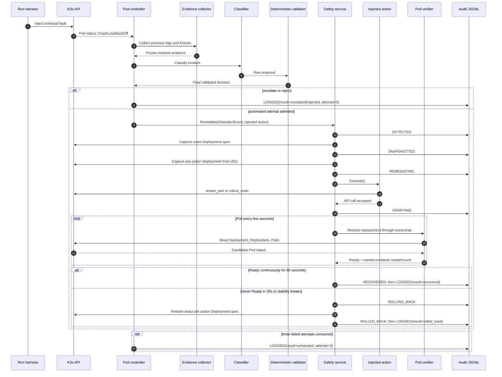
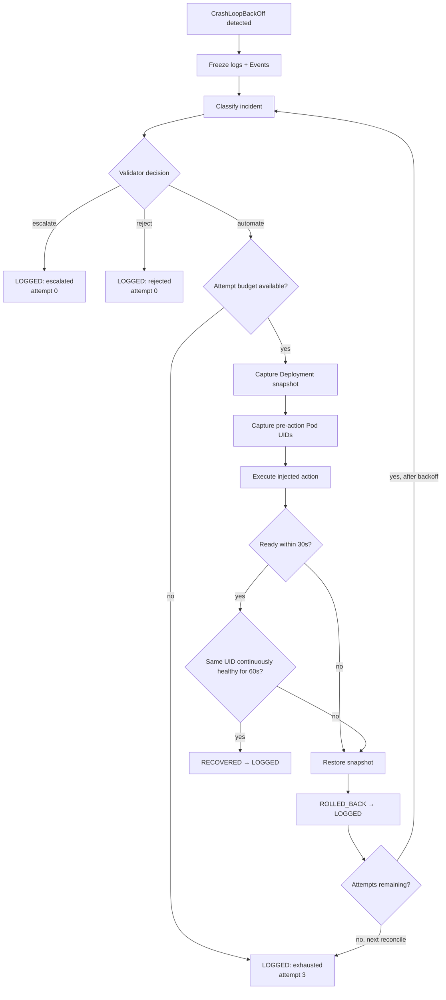
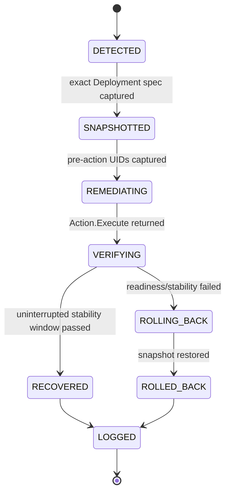
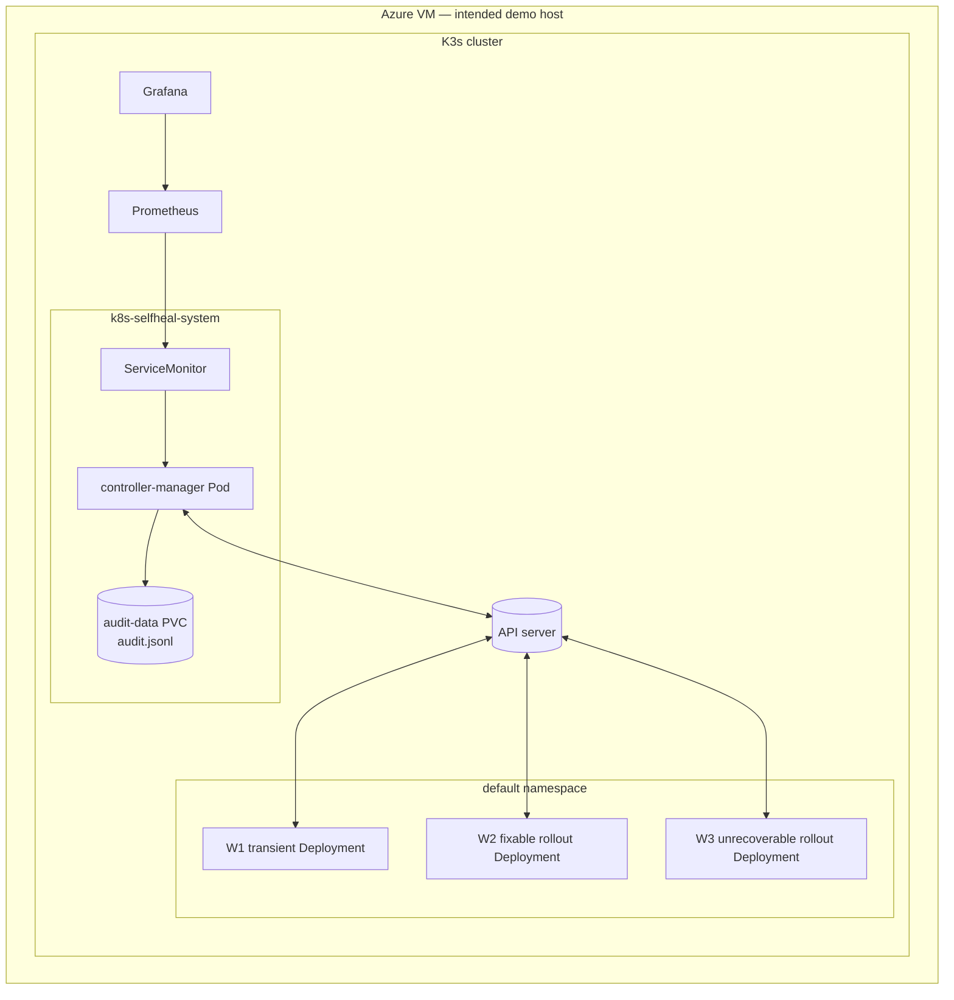

# SAGE-K8s final-week diagrams

The diagrams use labels and shapes that remain distinguishable when printed in
greyscale.

## Component architecture

```mermaid
flowchart LR
    FI[Fault injector / run harness]
    API[(K3s API server)]
    PC[Pod controller\nCrashLoopBackOff detection]
    EC[Evidence collector\nlogs + Events]
    CL[LLM classifier\nproposal only]
    VA[Deterministic validator\nsemantic guard + allowlist]
    IM[Incident manager\nbudget + backoff + cooldown]
    SS[Safety service\nsnapshot → act → verify → restore]
    AC[Injected actions\nrestart_pod | rollout_undo]
    VR[Deployment Pod resolver + verifier\n30s Ready + 60s stable]
    AU[(Append-only audit.jsonl\nPVC + per-write sync)]
    PM[Prometheus]
    GF[Grafana]

    FI -->|apply W1/W2/W3| API
    API -->|Pod events| PC
    PC --> EC
    EC --> CL
    CL -->|raw proposal| VA
    VA -->|validated action or escalate| IM
    IM -->|admitted attempt| SS
    SS -->|execute injected callback| AC
    AC --> API
    SS --> VR
    VR -->|Deployment → ReplicaSet → Pod| API
    SS -->|restore exact pre-action spec on failure| API
    SS --> AU
    PC --> AU
    PC --> PM
    PM --> GF
```

## Incident sequence



## Control loop



## Safety state machine



`exhausted`, `escalated`, and `rejected` are incident outcomes written as
`LOGGED` records. They are not new states in this attempt-level state machine.

## Deployment view



The diagram describes the repository deployment configuration. VM availability
must be checked separately and is not inferred from this source.

